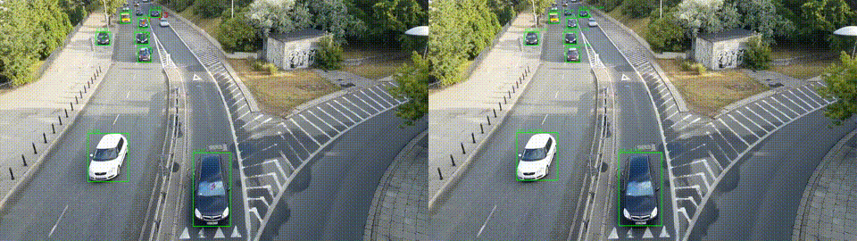

# 🚦 CAV Multi-Object Tracking (YOLO + Norfair)

## 🎬 Demo


This GIF shows:
- YOLO11 detections (bounding boxes)
- Norfair multi-object tracking (persistent track IDs)
- Simultaneous tracking of pedestrians and vehicles in a traffic scene.


This repository implements a lightweight, modular perception pipeline for **multi-object detection and tracking in traffic scenes**, with a focus on **pedestrians and vehicles** for Connected and Automated Vehicles (CAV) and Intelligent Transportation Systems (ITS).

The pipeline performs:
- **Object detection** using Ultralytics **YOLO11**
- **Online multi-object tracking** using **Norfair**
- **Trajectory export** to structured JSON for downstream analysis
- **ROI-based pedestrian behavior analysis** (optional)

---

## 🎯 Motivation

In real-world transportation systems, it is not enough to only detect objects — we must:
- Maintain **consistent identities over time (tracking)**
- Analyze **motion patterns**
- Enable **quantitative evaluation and downstream reasoning**

This project demonstrates an end-to-end perception workflow that can be extended to:
- Risk assessment
- Behavior prediction
- Traffic analytics
- CAV safety logic

---

## 🧠 What This System Does

### ✅ Detection
- Uses **YOLO11 (`yolo11n.pt`)** trained on COCO.
- Detects:
  - Person (pedestrian)
  - Bicycle
  - Car
  - Motorcycle
  - Bus
  - Truck

### 🔁 Tracking
- Uses **Norfair** for online tracking based on bounding-box centroids.
- Assigns persistent **track IDs** to each object over time.

### 📁 Data Output
For every video processed, the system produces:

| File | Description |
|------|-------------|
| `outputs/tracked.mp4` | Visualization with bounding boxes + track IDs |
| `outputs/tracked.tracks.json` | Per-object trajectories (frame, x, y, class, confidence, bbox) |

Example JSON format:
```json
{
  "3": [
    {"frame": 12, "x": 423.2, "y": 281.5, "cls_id": 0, "conf": 0.67, "bbox": [400,260,450,300]},
    {"frame": 13, "x": 425.1, "y": 283.0, "cls_id": 0, "conf": 0.65, "bbox": [402,262,452,302]}
  ]
}
#The same video was downloaded from kaggle sample traffic data
cav-multi-object-tracking/
│
├── scripts/
│   ├── run_tracking.py          # Detection + Tracking + JSON export
│   └── detect_roi_events.py     # (Optional) Pedestrian ROI analysis
│
├── data/
│   └── 4KRoad_traffic_video.mp4 # Example input video
│
├── outputs/
│   ├── tracked.mp4
│   └── tracked.tracks.json
│
├── requirements.txt
└── README.md

Installation steps
# Create virtual environment
python3 -m venv .venv
source .venv/bin/activate

# Install dependencies
pip install -r requirements.txt

#Steps for execution
python3 scripts/run_tracking.py \
  --source data/4KRoad_traffic_video.mp4 \
  --model yolo11n.pt \
  --out outputs/tracked.mp4 \
  --json_out outputs/tracked.tracks.json

## 🔬 Tracker Comparison Demo (Norfair vs ByteTrack)


The tracker comparison results can be found as gif in outputs/compare_demo.gif

**What this shows:**
- **Left:** Norfair (centroid-based online tracking)  
- **Right:** Ultralytics ByteTrack (motion + confidence-based tracking)  
- Same YOLO11 detector, same video, same confidence threshold.

**Key qualitative differences you can observe:**
- Norfair tends to be lighter and simpler but can be sensitive to occlusions.  
- ByteTrack generally provides smoother ID continuity in dense traffic.

## 📊 Qualitative Comparison (Summary)

| Tracker | Strengths | Limitations | Best Use Case |
|--------|-----------|-------------|---------------|
| **Norfair** | Lightweight, transparent, easy to interpret | More sensitive to occlusion and missed detections | Real-time or embedded systems |
| **ByteTrack** | Better ID continuity in dense traffic | Heavier, less transparent | Urban traffic, crowded scenes |

Note: Both trackers used the same YOLO11 detector and identical confidence thresholds.
